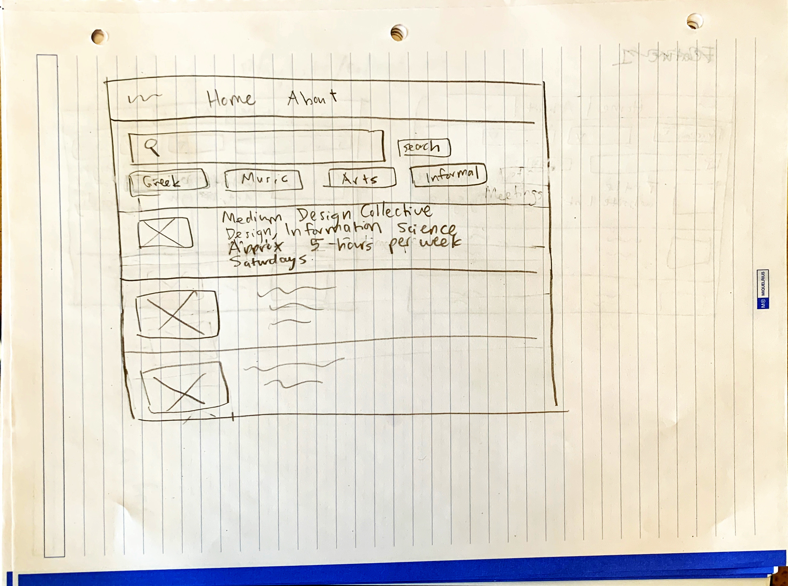
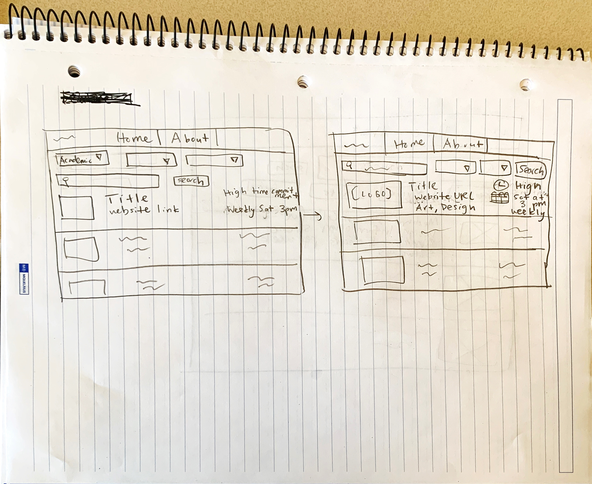

# Project 2: Design Journey

Be clear and concise in your writing. Bullets points are encouraged.

**Everything, including images, must be visible in VS Code's Markdown Preview.** If it's not visible in Markdown Preview, then we won't grade it.

## Catalog (Milestone 1)

### Describe your Catalog (Milestone 1)
> What will your collection be about? What types of attributes will you keep track of for the *things* in your catalog? 1-2 sentences.
My collection will be a catalog for professional or career-related clubs and student organizations at Cornell. I will keep track of the name of each club or student organization, the type of career the club is related to, its mission, and website link.

### Target Audience(s) (Milestone 1)
> Tell us about your target audience(s).
My target audiences will be students who are interested in joining a new club on campus and the members of clubs who want their club to be included on my catalog. It's important that the catalog isn't overwhelming and doesn't discourage students from wanting to join a club. Additionally, it's important that club members feel that their website is accurately and fully represented on my catalog.

### Design Patterns (Milestone 1)
> Review some existing catalog that are similar to yours. List the catalog's you reviewed here. Write a small reflection on how you might use the design patterns you identified in your review in your own catalog.
* Cornell CampusGroups Catalog

I will include the search bar and categories the user can filter by at the top of the page like Cornell CampusGroups did. Then, the search bar will be the first thing the user sees. This is important because most users will probably want to use the filter or search functionality instead of searching through the entire list of clubs. They will want to filter the clubs to only see the clubs related to their major or career path. Instead of just displaying the URL, each club also has a button for their website so the user can easily visit it. The user must click on the name of the club to be directed to a page with more information about it. This is a better alternative to displaying the description of every club in the catalog, which would look crowded and dense.

## Design & Planning (Milestone 2)

## Design Process (Milestone 2)
> Document your design process. Show us the evolution of your design from your first idea (sketch) to design you wish to implement (sketch). Show us the process you used to organize content and plan the navigation, if applicable.
> Label all images. All labels must be visible in VS Code's Markdown Preview.
> Clearly label the final design.

## Partials (Milestone 2)
> If you have any partials, plan them here.
I will have a navigation bar partial on every page of the website. The table of
organizations and groups on campus
will be a partial itself that updates with new data based on the filters
selected by the user.

## Database Schema (Milestone 2)
> Describe the structure of your database. You may use words or a picture. A bulleted list is probably the simplest way to do this. Make sure you include constraints for each field.

Table: clubs
-Name: name of organization or club, text and not null
-Link: Website URl of club, no constraint
-Category: More broad category club falls into, text and not null
-Subcategory: Subcategory club falls in, text and not null
-Commitment: how many hours per week the club requires members to put in on average, integer and not null
-Frequency: how often club meets (biweekly or weekly, etc.), text and not null
-Day: day of the week club meets, text
-Time: time that club meets including AM or PM, text
-Location: where the club meets, text
-Application: whether an application is required, text and not null

## Database Query Plan (Milestone 2)
> Plan your database queries. You may use natural language, pseudocode, or SQL.]

1. All records

SELECT * from clubs;
2. Search records

Select clubs that have a field with a value equal to the value searched by the user

3. Insert record

INSERT INTO clubs (Name, Link, Category, Subcategory, Commitment, Frequency, Day, Time, Location, Application)
VALUES ('Medium Design Collective', null, 'Professional', 'Design', 5, 'weekly', 'Saturday', '3 PM', 'Sibley Hall', 'yes');

## Code Planning (Milestone 2)
> Plan any PHP code you'll need here.
To search records:
SELECT * from clubs WHERE (NAME = "input") OR (LINK="input") OR (CATEGORY="input") ....

# Reflection (Final Submission)
> Take this time to reflect on what you learned during this assignment. How have you improved since Project 1? What things did you have trouble with?
I have improved in considering the usability of an interface, how to prioritze information that the user wants through design, and
how to think of the information users want most. I had trouble with resisting the urge to just erase parts of my design while drawing it. Instead, I should finish a full iteration of the design and make changes in the next iteration to show my progress and also test every idea I have and see how it looks before eliminating it as an option.
